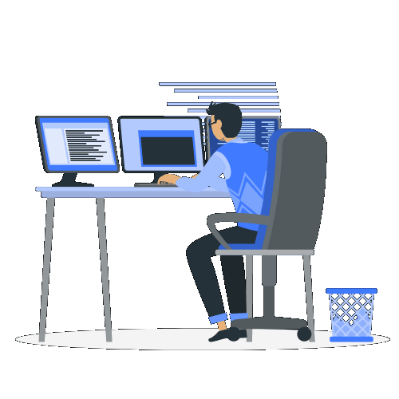

  

  

  

    

      👩‍❤️‍👨 <b>Saya mencintai istri saya, dan ini adalah situs web kami:</b>
    

    
  

  

 

---

## 👨‍💻 Tentang Saya
Halo! Saya adalah pengembang yang bersemangat, fokus pada pembelajaran berkelanjutan dan membangun perangkat lunak berkualitas tinggi. Saya senang mengeksplorasi teknologi baru, mengotomatisasi tugas, dan menciptakan solusi yang efisien.

---

## 🛠️ Tumpukan Teknologi & Perkakas

### 💻 Bahasa Pemrograman

  

### 🧰 Perkakas & Platform

  

### ⚙️ Perkakas yang Sering Digunakan

  
  
  
  
  

### 💬 Komunikasi

  
  
  
  

### 🤖 Perkakas AI

  
  
  

---

## ⏱️ Aktivitas Ngoding

  

---

   
  
  
    
  
  <h2>📖 Kutipan Islami</h2>
  

    

      حَسْبُنَا اللَّهُ وَنِعْمَ الْوَكِيلُ نِعْمَ الْمَوْلَىٰ وَنِعْمَ النَّصِيرُ
    

    

      <b>Hasbunallahu wa ni'mal wakil ni'mal maula wa ni'man nashir</b>
    

    

      "Cukuplah Allah menjadi Penolong kami dan Allah adalah sebaik-baik Pelindung dan sebaik-baik Penolong."
    

  

  
 
  <audio controls>
    <source src="./assets/ARABIC-SOUND.mp3" type="audio/mpeg">
    Browser kamu tidak mendukung audio.
  </audio>
 

  

